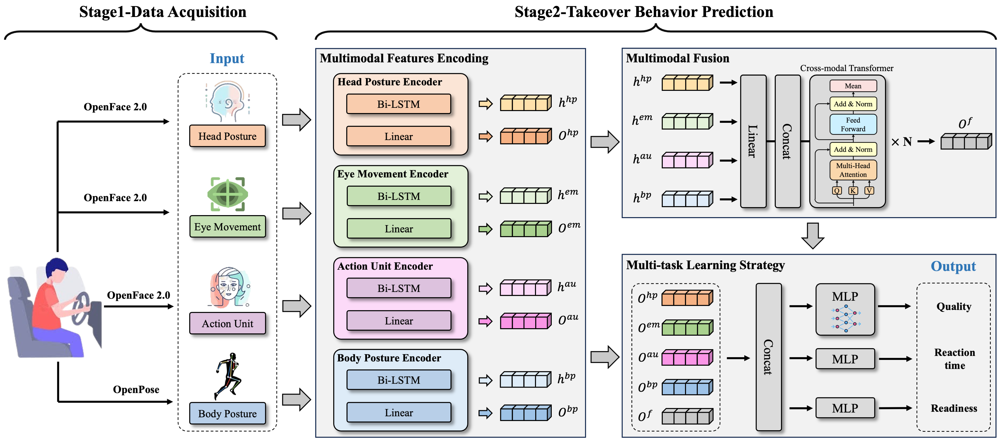

# **Multi-TBP**

#### Codebase for CHI 2025 Late-Breaking Work Paper:

> **Exploring the Impact of Drivers' Emotion and Multi-task Learning on Takeover Behavior Prediction in Multimodal Environment**

#### Model Architecture:



The code was refactored to integrate all experiments and baselines; please contact me if you find any bugs. Thanks.

## **Content**

- [Data Preparation](#1)
- [Environment](#2)
- [Running](#3)
- [Note](#4)
- [Citation](#5)

<h2 id="1">Data Preparation</h2>

- This study selected the **EmoTake dataset** to train Multi-TBP, which can be downloaded through this [link](https://github.com/yibingweng/EmoTake).
- We have placed the EmoTake dataset in the **"data" folder** and the dataset description (README) is also included.

<h2 id="2">Environment</h2>

The paper's basic training environment for its results is Python 3.8, Pytorch 1.9.0 with a single NVIDIA RTX 3090. Notably, different hardware and software environments can cause the results to fluctuate.

<h2 id="3">Running</h2>

1. For the dataset or task being executed, you can adjust necessary parameters in **"opts.py"**, such as "--datasetName", "--labelType", "--num_class", or "--data_path", etc.

2. After adjusting the parameters, you can run this project with the following command:

   ```shell
   python ./src/train.py
   ```

3. The output results will be saved in the **"log"** folder.

<h2 id="4">Note</h2>

1. Since Multi-TBP is not limited by the number of modalities, input data dimensions, and fusion data dimensions, it can be changed uniformly. Therefore, Multi-TBP can be extended to other datasets or applied to new scenarios according to your needs.

2. If you want to change the dataset or usage scenario, please update the parameters in **"opts.py"**.

3. We gratefully acknowledge the help of open-source projects used in this work 🎉🎉, including [EmoTake](https://github.com/yibingweng/EmoTake), etc 😄.

<h2 id="5">Citation</h2>

Paper publication address:

> [Exploring the Impact of Drivers' Emotion and Multi-task Learning on Takeover Behavior Prediction in Multimodal Environment](https://aclanthology.org/2024.findings-emnlp.865/)

Please cite our paper if you find it having other limitations and valuable for your research (卑微求引用 T^T) :

```txt
@inproceedings{feng2025exploring,
  title={Exploring the Impact of Drivers' Emotion and Multi-task Learning on Takeover Behavior Prediction in Multimodal Environment},
  author={Feng, Xinyu and Gu, Yu and Lin, Yuming and Cai, Yaojun},
  booktitle={Findings of the Association for Computational Linguistics: EMNLP 2024},
  pages={14755--14766},
  year={2025}
}
```
